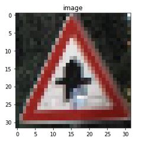
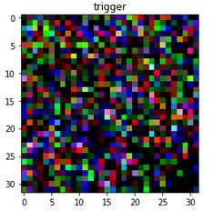
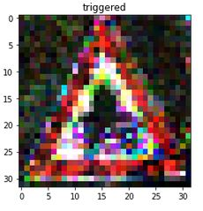

The goals of this Project are 

1. To implement partially an optimization procedure presented in the
paper: _Neural Cleanse: Identifying and Mitigating Backdoor Attacks in Neural Networks_. 
By partially I mean implementation is not one-to-one to the optimization procedure. 

2. Run this project completely on google colab

The purpose of this is to lear how one can use Keras custom training loops. 
Under keras custom training loop I mean, defining own loss function, and own layers.

The dataset and model are taken from Bolun Wang's [Repository](https://github.com/bolunwang/backdoor). 
The code is partially based on Bolun Wang's implementation as well.

Possible output after running `generate_trigger.ipynb`:

  
   
  

trial